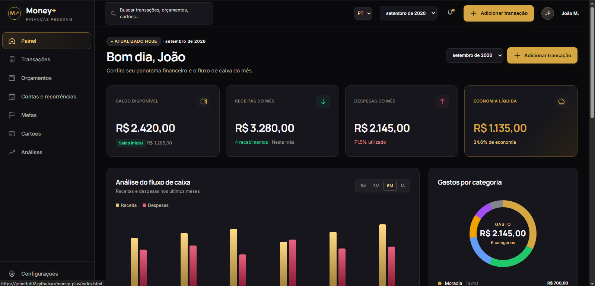
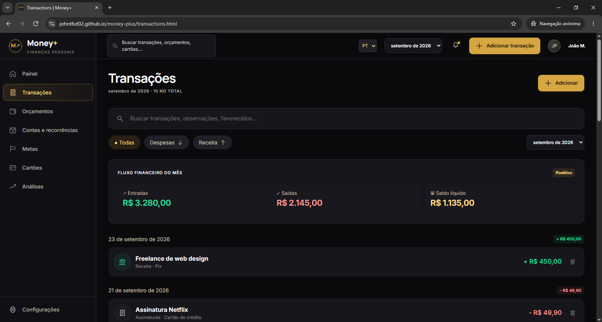
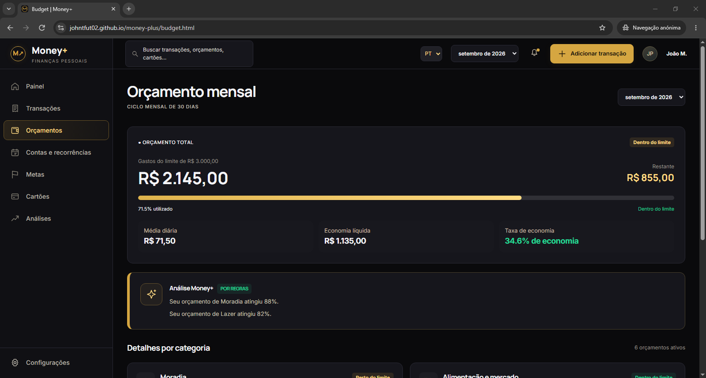

# Money+

Money+ is a responsive personal finance tracker built with HTML, CSS and Vanilla JavaScript.

## Continue this project

Read the [complete handoff in Portuguese](docs/CONTINUIDADE.md) for the current implementation, Firebase setup, design assets, test evidence, pending work and the learning workflow. It includes a ready-to-copy prompt for a new chat.

## Run

Use VS Code Live Server and open `login.html`. ES modules require an HTTP server. No framework or build step is needed. Internet access is required for Firebase login and financial data.

## Portfolio Project

Money+ is a front-end portfolio project focused on responsive interfaces, DOM manipulation, financial calculations and private Firebase persistence using Vanilla JavaScript. Only the language preference uses localStorage.

## Features

- Native Portuguese/English selector with a saved browser preference
- Responsive dashboard with desktop sidebar and mobile bottom navigation
- Transaction tracking: search, income/expense filters, add, edit and delete with confirmation
- Income, expense, balance and savings calculations
- Category budgets and explicit over-budget labels
- Google login and private Firestore transactions per UID
- Empty new accounts, zero opening balance, current month and next 12 months
- Rule-based financial insights
- CSS cash flow chart and calculated category donut

## Tech

HTML5 · CSS3 · Vanilla JavaScript modules · Firebase Authentication · Cloud Firestore

## Structure

```
index.html
login.html
transactions.html
add-transaction.html
budget.html
css/style.css
css/login.css
js/app.js
js/i18n.js
js/firebase-config.js
js/login.js
js/transactions-store.js
js/budgets-store.js
js/settings-store.js
js/csv-export.js
assets/money-plus.png
docs/CONTINUIDADE.md
docs/exportacao-csv.md
firestore.rules
tests/
```

`app.js` contains the shared dataset, named calculation functions, rendering functions and form handlers. CSS is organized into design tokens, page styles and responsive rules.

## Account data and calculations

Transactions are stored under `users/{uid}/transactions/{transactionId}`. Pages wait for authentication and a server read before displaying financial data. Save and delete success is shown only after server acknowledgement. Existing browser demo data is not imported or erased.

The pencil action opens the existing form with the transaction's saved fields. Editing keeps the document ID, waits for server acknowledgement and returns to the saved date's month. Failed edits preserve the input; a transaction deleted elsewhere is not recreated. See the [editing guide](docs/edicao-transacoes.md).

New accounts start with no transactions and an opening balance of zero. Months include the current local month, the next 12 months and months with saved transactions. Charts use real data. Currency is BRL. Monthly category budget limits start at zero and can be edited on the Budget page. They are stored privately under `users/{uid}/budgets/{YYYY-MM}`, with category amounts in `limits`. Zero means no limit is configured; saving one category preserves the others. Upcoming payments are a future feature. Language preference alone is saved in localStorage.

The Firebase project must enable Google sign-in and authorize the host (localhost/127.0.0.1 for local testing and johntfut02.github.io for the published site). Firestore rules must require `request.auth != null && request.auth.uid == userId` for documents and subcollections under `users/{userId}`. Client validation does not replace server-side field validation in future rules.

Opening balance can be set on the dashboard, with a start date. It is stored privately under users/{uid}/settings/finance. Available balance includes transactions from that date through the selected month; earlier months show an unavailable balance. Monthly income and expense totals still include all transactions for their month.

## Live Demo

Transactions can be exported for the selected month with **Export CSV**. Includes dates, descriptions, categories, payment methods, signed BRL amounts and notes. The export follows the site's PT/EN language and includes the full month regardless of search/type filters. See [CSV guide](docs/exportacao-csv.md).

https://johntfut02.github.io/money-plus/

## Screenshots

### Desktop Dashboard


### Transactions


### Budget


## Future Improvements

- Goals
- Credit cards
- Recurring payments
- Dedicated analysis page
- Stronger server-side document validation

## Tests

Run `node tests/account-flows.test.cjs` and `node tests/csv-export.test.mjs`. The account suite uses simulated Firebase/DOM; it does not exercise deployed Firestore rules. `firestore.rules` is a reference copy and is not deployed by GitHub Pages. See the handoff for the live tests already reported by the user and remaining checks.
